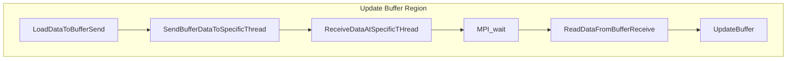
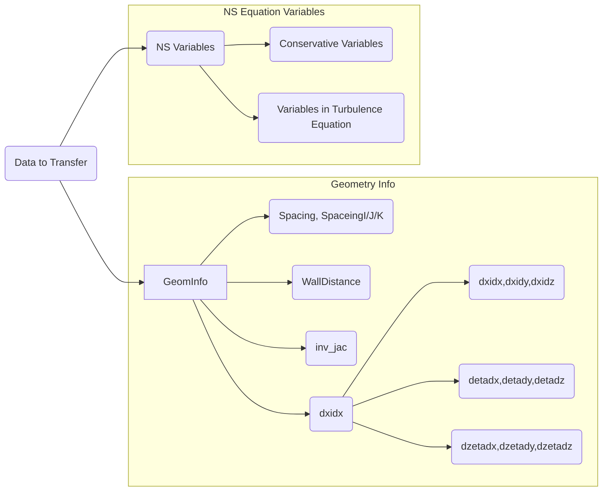

# The Strategy of Updating Buffer Block

Step 1: Load data from main block into buffer_send

Step 2: Send buffer_send to specific thread using mpi function

Step 3: Receive data which is sent to local thread using buffer_recv

Step 4: MPI_wait is implemented for MPI purpose

Step 5: Read data from buffer_recv

Step 6: Update buffer region

  

